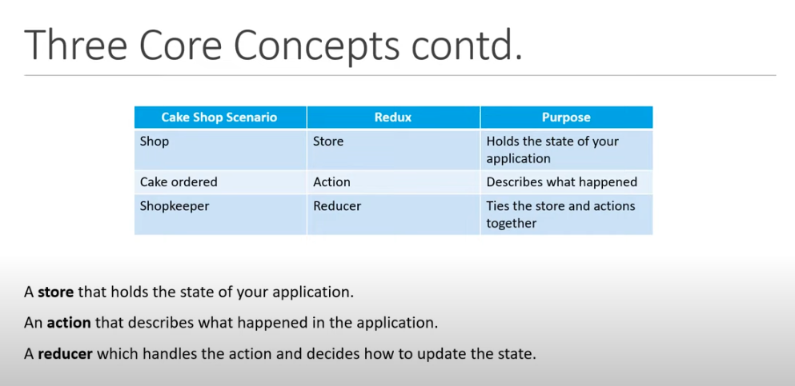
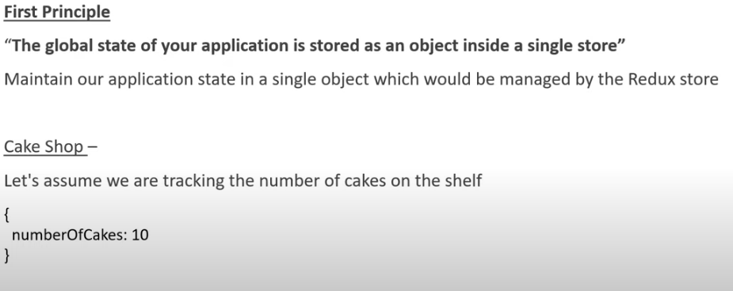
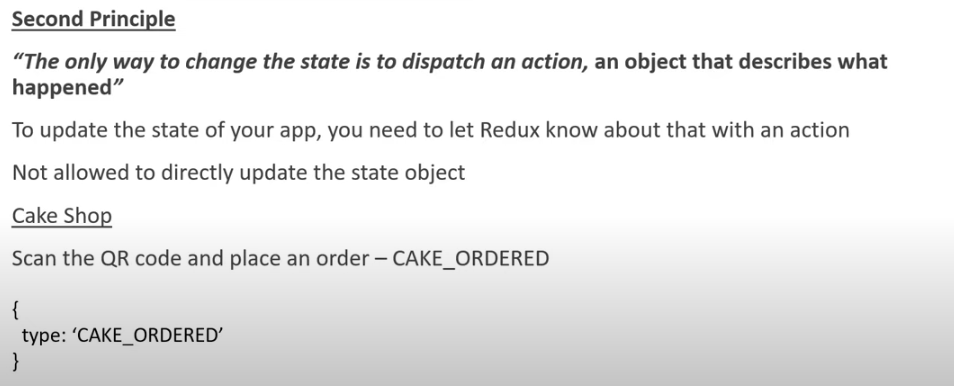
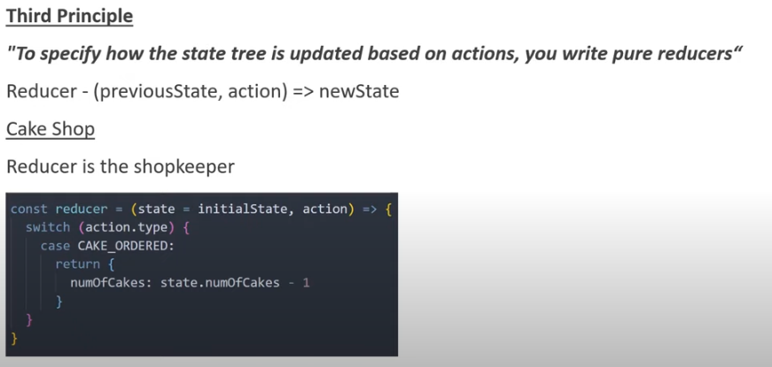
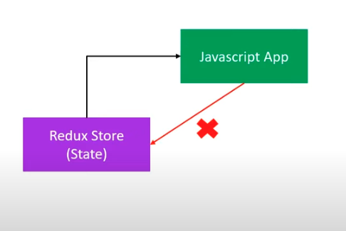
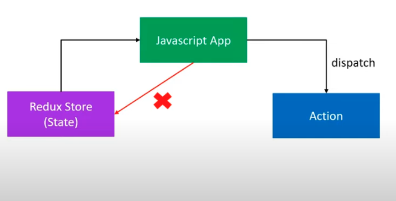
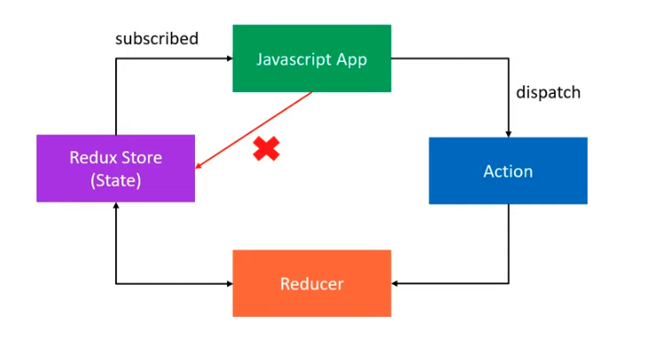

---
<a name="Back_To_Top"></a> Top
---

- ### [Core concepts](#Core_concepts)
- ### [Principles](#Principles)

---

## <a name="Core_concepts"></a>Core concepts

Lets use a cake shop as an example to explain the core concepts in Redux. In this cake shop since we are in a pandemic you have to scan a qr code to place an order. The shopkeeper of the store is there to follow a process for you to purchase a cake.

- You scan the code, select red velvet cake, and thereby place an order on your phone. 
- If the cake is available he will box it for you, deduct a cake from his inventory and print out a receipt to keep track of the purchase. This will let him know why the number of cakes on the shelf has decreased. 

## How does this scenario relate to the core concepts in Redux?



## <a name="Principles"></a>Principles

## Principle 1 - Store



## Principle 2 - Actions



- An action is simply an object with a type property
- With Redux we need to implement what is known as an action creator. An action creator is a function that returns an action.

```js
const BUY_CAKE = 'BUY_CAKE'

function buyCake() {
    return {
        type: BUY_CAKE,
        info: 'First Redux action'
    }
}
```

## Principle 3 - Reducers



- A reducer function is a pure function that accepts state and action as arguments and returns the next state of the application
- Note we are not mutating the state object, we're returning a new object

```js
const initialState = {
    numOfCakes: 10
}

const reducer = (state = initialState, action) => {
    switch(action.type) {
        case BUY_CAKE: return {
            ...state,
            numOfCakes: state.numOfCakes - 1
        }
        default: return state
    }
}
```

## Visualising the 3 Principles

- We start off with a simple JavaScript application
- The state of the application is maintained separately in the Redux Store
- Our application is always subscribed to this Redux Store
- However the app cannot directly update the applications state



- If the application wants to update the state it has to emit or dispatch an action



- Once an action has been dispatched, the reducer then handles that action and updates the current state



- As soon as the state is updated the value is then passed to the application because the app is subscribed to the store


```js
const redux = require('redux')
const createStore = redux.createStore // <- createStore is deprecated

// action
const BUY_CAKE = 'BUY_CAKE'

// action creator
function buyCake() {
    return {
        type: BUY_CAKE,
        info: 'First Redux action'
    }
}

const initialState = {
    numOfCakes: 10
}

// reducer functions always accept state and action as arguments
const reducer = (state = initialState, action) => {
    switch (action.type) {
        case BUY_CAKE: return {
            ...state,
            numOfCakes: state.numOfCakes - 1
        }
        default: return state
    }
}

// createStore method accepts the reducer as argument which ultimately updates the state held by the store
const store = createStore(reducer)
console.log('Initial state', store.getState())
const unsubscribe = store.subscribe(() => console.log('Updated state', store.getState()))
store.dispatch(buyCake())
store.dispatch(buyCake())
store.dispatch(buyCake())
unsubscribe()
store.dispatch(buyCake())
```

---

- [Top](#Back_To_Top)

---
