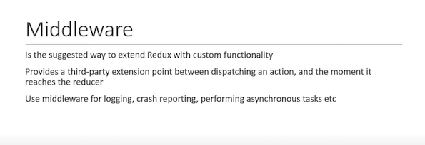
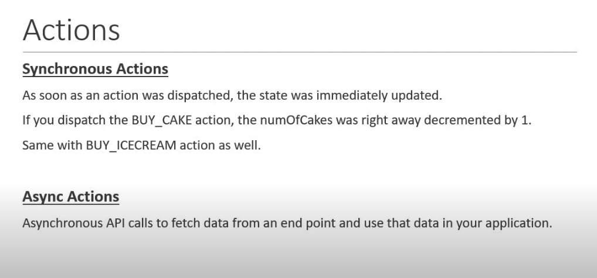

---
<a name="Back_To_Top"></a> Top
---

- ### [Multiple reducers](#Multiple_reducers)
- ### [Middleware](#Middleware)
- ### [Async actions](#Async_actions)

---

## <a name="Multiple_reducers"></a>Multiple reducers

Redux provides a method called `combineReducers` to combine multiple reducers into a single reducer which can then be passed to the createStore method.

> ### The convention is to call the combination of all your reducers as the root reducer.

```js
const redux = require('redux')
const createStore = redux.createStore
const combineReducers = redux.combineReducers

const BUY_CAKE = 'BUY_CAKE'
const BUY_ICECREAM = 'BUY_ICECREAM'

function buyCake() {
    return {
        type: BUY_CAKE,
        info: 'First Redux action'
    }
}

function buyIceCream() {
    return {
        type: BUY_ICECREAM,
        info: 'Buying an icecream'
    }
}

const initialCakeState = {
    numOfCakes: 10
}

const initialIcecreamState = {
    numOfIcecreams: 20
}

const cakeReducer = (state = initialCakeState, action) => {
    switch (action.type) {
        case BUY_CAKE: return {
            ...state,
            numOfCakes: state.numOfCakes - 1
        }
        default: return state
    }
}

const icecreamReducer = (state = initialIcecreamState, action) => {
    switch (action.type) {
        case BUY_ICECREAM: return {
            ...state,
            numOfIcecreams: state.numOfIcecreams - 1
        }
        default: return state
    }
}

const rootReducer = combineReducers({
    cake: cakeReducer,
    iceCream: icecreamReducer
})

const store = createStore(rootReducer)
console.log('Initial state', store.getState())
const unsubscribe = store.subscribe(() => console.log('Updated state', store.getState()))
store.dispatch(buyCake())
store.dispatch(buyIceCream())
store.dispatch(buyIceCream())
unsubscribe()
```

```shell
Initial state { cake: { numOfCakes: 10 }, iceCream: { numOfIcecreams: 20 } }
Updated state { cake: { numOfCakes: 9 }, iceCream: { numOfIcecreams: 20 } }
Updated state { cake: { numOfCakes: 9 }, iceCream: { numOfIcecreams: 19 } }
Updated state { cake: { numOfCakes: 9 }, iceCream: { numOfIcecreams: 18 } }
```

To access the number of cakes we need to access `state.cake.numOfCakes`. 

> ### Each of the reducers is now managing its own part of the global state. The state parameter is different for each reducer and corresponds to the part of the state which it manages.

---

- [Top](#Back_To_Top)

---

## <a name="Middleware"></a>Middleware



If you want Redux with extra functionality, middleware is the way to go.

-> import applyMiddleware and your middleware of choice

```js
const reduxLogger = require('redux-logger')
const applyMiddleware = redux.applyMiddleware
const logger = reduxLogger.createLogger()
```

-> pass it as an argument to createStore

```js
const store = createStore(rootReducer, applyMiddleware(logger))
```

> ### This is one of the most important concepts in Redux as it is how you extend Redux with additional functionality. To perform Asynchronous actions in Redux it also requires a middleware.

---

- [Top](#Back_To_Top)

---

## <a name="Async_actions"></a>Async actions



Lets look at an example where our application fetches a list of users from an api endpoint and stores it in the redux store. 

> ### Redux thunk is a redux middleware for defining async action creators

What redux thunk brings to the table is the ability for an action creator to return a function instead of an action object. This function doesn't have to be pure, so it can return side effects such as async API calls. This function can also dispatch actions such as the ones we've seen before using the `dispatch` method.

---

- [Top](#Back_To_Top)

---